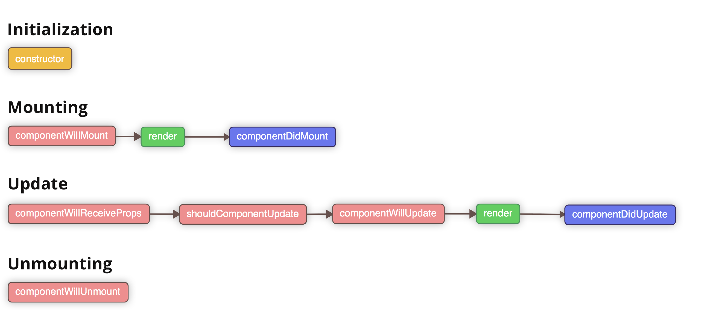

Let's see what happens when you add your component to render tree.

Overall we have 4 big phases in components life.

* [Initialization](#initialization)
* [Mounting](#mounting)
* [Update](#update)
* [Unmounting](#unmounting)

In every phase there are several methods being called

## Initialization

First goes the __initialization__ phase.

And first one to be called is the `constructor` method. This is the place where you initialize your component, set your initial state, default props or bind `this` to functions that need it.
Don't use this method for anything other than setting up your component. Please, no `AJAX` calls or reading/writing to database.

## Mounting

Initialization phase is followed by __mounting__ phase.

First method that gets executed in this phase is `componentWillMount` and its usage is mostly same as of `constructor` – to set up initial state and default props. Warning, `componentWillMount` and other `componentWill...` methods are deprecated, use `componentDidMount` or `constructor` instead of this one.

Next `render` method is executed. You are already familiar with this one. This method mounts component to DOM.

After the component is mounted to DOM – `componentDidMount` gets called. As this function is being executed only once in the whole lifecycle – it's a good place to put your AJAX requests.

## Update

After __mounting__ phase is completed – component goes to __update__ phase.

First method to be called in this phase is `componentWillReceiveProps(newProps)`. This method is getting called every time props that are passed to this component get updated.
This method receives all the props so you can manually update your state depending on what props did change.
Warning this method is deprecated along with most other `componentWill...` methods.

Next is `shouldComponentUpdate(nextProps, nextState, nextContext)`. By default component gets updated every time props passed to it, it's state or its context gets changed. This method allows you to prevent unnecessary update by returning `false`.

Then goes `componentWillUpdate(nextProps, nextState)`. Deprecated as a few other `componentWill...` methods.

Then as in __mounting__ phase, we have `render` method. 

After `render` method was executed successfully we have `componentDidUpdate` which you can use to perform AJAX calls and other side-effect causing operations.

Since React 16 we have now have `componentDidCatch(errorString, errorInfo)` method. This method works similar to javascript `try/catch` block but for components. You can use this method in parent component to catch errors happened in its children. It receives to parameters

* `errorString` – the message of an error
* `info` – an object with a single field componentStack which represent the stack trace back to where the error occurred.

Keep in mind that this method will only catch errors in the components below the parent in the tree. It won't catch the errors happened in the component itself.

## Unmounting

And the final phase of life of any react component is __unmounting__ phase.

There is only one method in this phase. It's `componentWillUnmount` and this is the only one `compoenentWIll...` method that didn't get deprecated.

This method is executed just before your component gets removed from the __DOM__

Use this method to clean up after your component. Remove all timers or listeners created during the lifetime of your component to prevent memory leaks.
